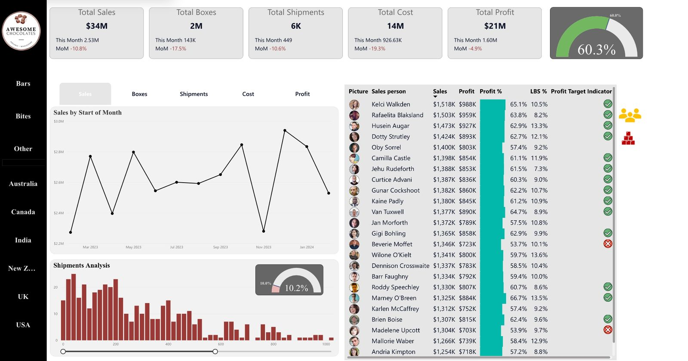

# Chocolate Sales Analysis Dashboard (Power BI)

## Project Overview

This project presents an end-to-end sales analytics dashboard built using Power BI.  
It focuses on analyzing business performance across sales, profit, shipments, and operational efficiency.

The dashboard enables interactive exploration of data through dynamic visuals, KPIs, and advanced analytical features.

---

## Dashboard Preview

---

## Key Insights

- Business performance shows a recent decline across all KPIs, driven mainly by reduced shipment volume.
- Sales, shipments, and boxes follow a highly correlated pattern, indicating that order volume is the primary driver of performance.
- A sharp drop is observed in November, followed by recovery, suggesting a temporary disruption rather than a long-term issue.
- Profit remains relatively stable despite declining sales due to effective cost control.
- Profit margin is slightly above target (60.1%), but the narrow margin indicates potential risk if the decline continues.
- Shipment distribution is skewed toward lower shipment ranges, which may reduce operational efficiency.
- Some products generate high sales but fail to meet profit targets, indicating pricing or cost inefficiencies.
- Salesperson performance is generally consistent, though a few individuals do not meet profitability targets.

---

## Features & Analysis

### KPI Cards

- Track Total Sales, Profit, Cost, Shipments, and Boxes
- Highlight Month-over-Month (MoM) performance
- Reveal recent performance decline

---

### Trend Analysis

- Time-series analysis for Sales, Profit, Cost, and Shipments
- Identifies volatility and demand fluctuations
- Detects sudden drops and recovery patterns

---

### Salesperson Analysis

- Compare performance across individuals
- Identify underperformers and top contributors
- Evaluate profit margin consistency

---

### Product Analysis

- Analyze product-level sales and profitability
- Identify high-volume, low-margin products
- Highlight inefficiencies in product performance

---

### Shipment Distribution

- Histogram to analyze shipment sizes
- LBS% (Low Box Shipments) indicator
- Evaluate operational efficiency

---

### Profit Target (Gauge Chart)

- Compare Profit % against target
- Monitor performance sustainability

---

### Advanced Features

- Dynamic measure selection using Field Parameters
- Interactive Tooltip dashboard for geo-based breakdown
- Clean and minimal UI to improve user experience

---

## Data Model

- Star schema design implemented
- Fact table: Shipments

### Dimension Tables

- Products
- People
- Locations
- Calendar

This structure enables flexible and scalable analysis across multiple dimensions.

---

## DAX Measures

Key measures created:

- Total Sales
- Total Cost
- Total Profit
- Profit %
- Total Shipments
- Total Boxes
- LBS %
- MoM Change %

Time intelligence functions were used to track performance trends over time.

---

## Tools Used

- Power BI
- DAX (Data Analysis Expressions)
- Data Modeling (Star Schema)

---

## Business Recommendations

- Investigate the cause of the November performance drop
- Optimize low-margin products to improve profitability
- Reduce dependency on small shipments to improve efficiency
- Monitor profit margin closely to maintain performance above target
- Improve consistency in demand through better planning or promotions

---

## Conclusion

This dashboard demonstrates how combining data modeling, DAX, and interactive visuals can uncover meaningful business insights.

The analysis highlights that performance is primarily driven by shipment volume, while operational efficiency and cost control play a critical role in maintaining profitability.

---

## Author

Aryam
